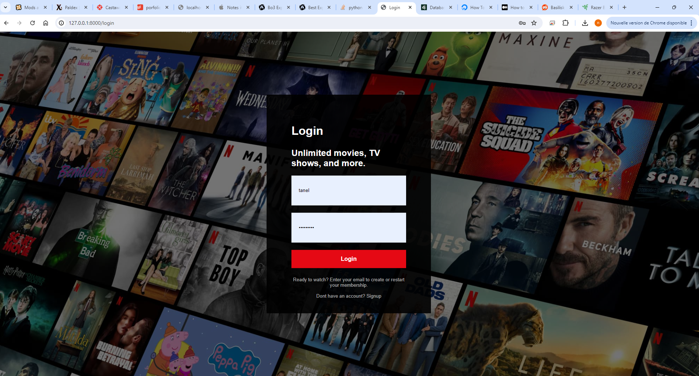
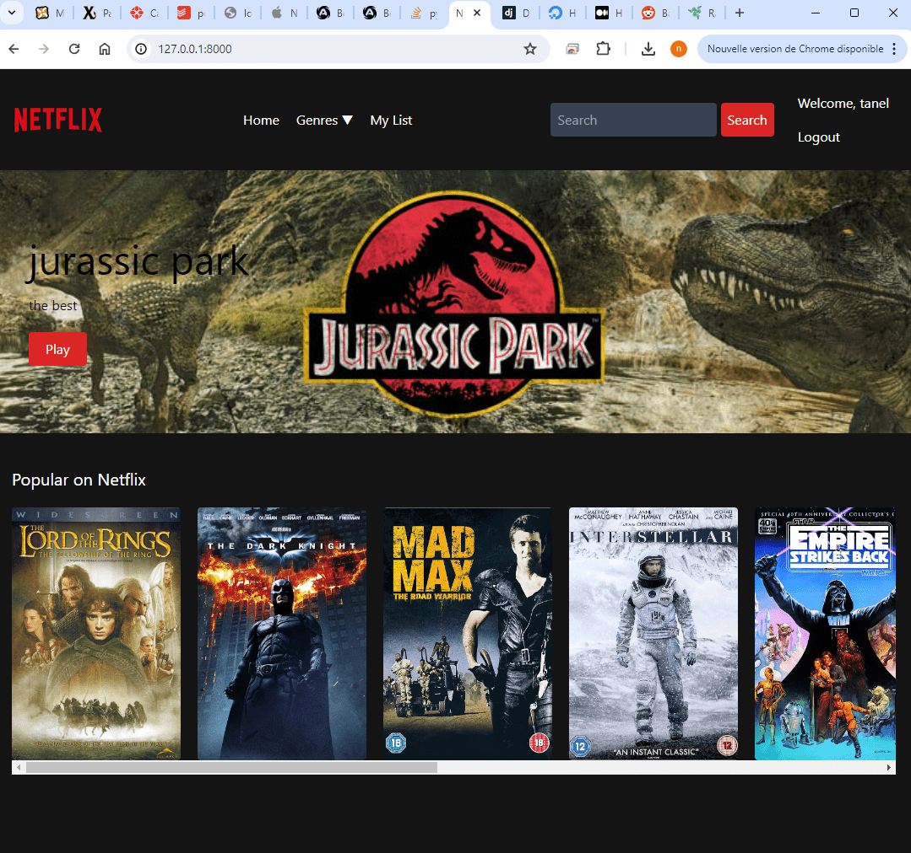
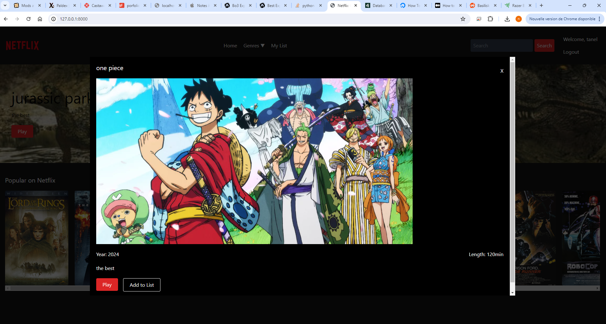

# Netflix clone with Django

This is a netflix clone website. it use python with django framework, html, css, javascript and tailwind css. the app show a range of video that the user can watch or add to a list
  
Ceci est un clone de netflix. Cette app a été dévellopée avec python en utilisant le framework django, html, css, javascript et tailwind css. l'application présente une sélection de vidéos que l'utilisateur peut regarder ou ajouter à une liste.
  

